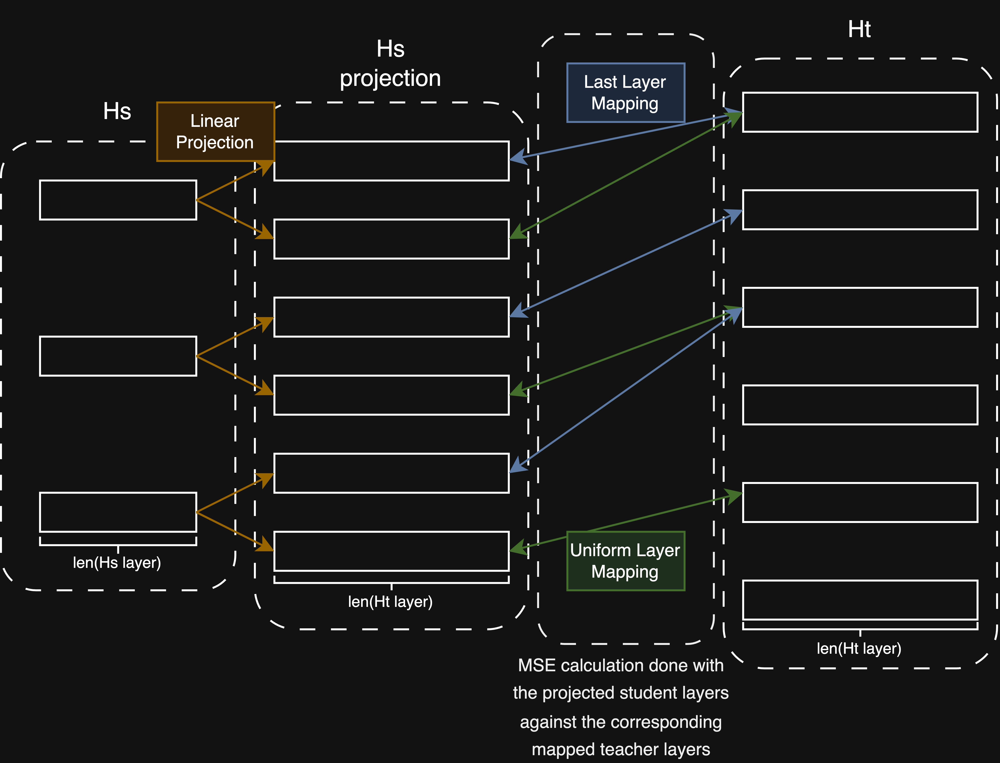

# adls_group_11: Knowledge distillation with neural architacture search for language models
## Overview

The project is centered around designing an efficient and automated optimization pipeline for knowledge distillation (KD) of language models. Our pipeline uses neural architecture search (NAS) to perform KD on a pool of student models. This allows for discovery of more optimal network structures while also enable us to expand the usability of the KD pipeline to a range of different models.

Our pipeline offers the following improvements compared to a conventional KD flow on a fixed student model:
- **Model-agnostic approach of KD utilizing masked layer modelling for training during distillation.** The pipeline works on a variety of language models (tested with ALBERT, RoBERTa, and variations of BERT) without extra modification. 
- **Highly automated pipeline with minimal human intervention required.** The student models are generated automatically within a search space defined by analyzing the teacher model configuration. The best performing models are then selected through NAS. Therefore an optimized student model can be obtained without any extra input besides teacher model and KD training data.
- **Faster KD with a multi-stage KD process.** This will be covered in more detail in the functionality description section.
- **More flexible training process.** Parameters in the pipeline process can be easily changed to optimize for accuracy, speed or generalization.

## Repository Structure
This repository is organized in the following order:
- **docs/**: Contains images and example Jupyter Notebooks that demonstrates key components of the KD pipeline in a code walkthrough style
- **kd/**: Contains the collection of functions and classes that implement the KD pipeline, ready to be imported and used
- **tests/**: Unit testing of the components in **kd/**

## Functionality Description
### Pipeline overview
Our pipeline can use either the built-in optimizer (optuna) or the reinforcement learning optimizer. The main steps of the KD process is summarized below:
1. Select a teacher model and a task dataset that can be used to train it.
2. Extract the architecture structure from the teacher model. Then use them to construct a search space for KD training on the student models.
3. Select a variety of student model choices.
4. For the first episode, using the search space to first randomly selects N candidate configs for student models.
5. Perform mini-KD on each candidate model. During the mini-KD training, each candidate model learns a mapping from the teacher model's layers to its own layers. The mini-KD training uses only 30% of the input dataset. Each candidate is trained for a few epochs (typically 4 or 5) and the loss at the last epoch is stored. The latency for each candidate is computed at the end of the training.
6. Using a reward function to calculate a performance score for each candidate models.
7. If using the optuna optimizer, the pipeline will automatically choose the more promising candidates from the search space. If using the RL optimizer, the candidate historys, including the global best, episode best and previous global best candidate configs are stored and passed in to a LSTM. The LSTM will be trained to predict the most promising candidate config.
8. At the end of each episode, decrease the exploration ratio so that in the end of the training, all candidate config will be chosen using the LSTM. This step is ignored for the optuna version.
9. At the end of the last episode, the global best model will be selected for post NAS training. This step can be skipped if one wish to prevent overfitting or if the model has a fast converging nature.
10. The trained best model will be tested using the glue score function.

A Jupyter Notebook version of RL KD NAS pipeline can be found in [docs/notebooks/kd_nas_lstm.ipynb](docs/notebooks/kd_nas/lstm.ipynb).


### Data Loader
This function uses a checkpoint of a pretrained model from Hugging face to load the dataset and the tokenizer.

### Construct Teacher Model
This function uses the previously loaded checkpoints to construct a teacher model to be used for the distillation process.

### Construct Search Space

Based on the teacher model configuration, automatically construct a dictionary of feasible architecture parameters for the student models. The search space includes the following parameters:
- **num_hidden_layers**: Number of transformer layers in the model
- **num_attention_heads**: Number of attention heads in each layer
- **hidden_size**: Dimension of the hidden representations
- **intermediate_size**: Dimension of the feedforward network
- **hidden_act**: Activation function used in the model

### Mini-KD

Our KD process is done with hidden state distillation. The aim is to let the student learn the hidden state representations from the teacher model. To account for differences in layer sizes of the teacher and student, we chose a multi-layer mapping strategy that allows each student layer to learn from two teacher layers. For a student with $L^s$ layers and a teacher with $L^t$ layers, a single student layer $i$ will learn from the teacher layers $L^t-L^s+i$ (last strategy) and $i \left\lfloor \frac{L^T}{L^S} \right\rfloor$ (skip strategy). 

Since a student layer can learn from two teacher layers, and the student model might have a smaller hidden state size, a linear projection of the student is used to map the student hidden states onto the teacher ones linearly, even if there are differences in hidden state sizes. This is done by using a learnable linear layer applied to each student layer that is also trained during the KD process. This linear layer projects a student layer with a hidden size $H_s$ to a size $2*H_t$. 



Then we compute the mean square error between the projected student and teacher hidden states. And finally we train the candidate model for a few epoches along with the projection layer. At the end the candidate model will be assigned a reward score, which is a combination of performance (MSE loss) and efficiency (latency). 

$reward = (1 - loss_{MSE}) · (latency_S / (β · latency_T))^α$

### Model Ranking

After training all the selected candidate models during a single episode, we need to rank them based on their rewards. We store the best performing model and its config into the global best tuple. As well as the prevously best performing model in the last episode and its config. We also need to store the config of all the candidate models that we have selected in that episode. These cached models are then used to train the RL controller.

### LSTM Unit
Our training loop includes a controller that uses past knowledge about model distillation to make prediction that selects the most promising candidates for the next episode. We used a LSTM unit as our controller. It takes as input the data of the global best model, the previous episode best model and all the candidates from the previous episode.

### Full KD Trainer
This function is used to perform post KD finetuning to the best performing model obtained from the NAS session. It works in the same way as the mini-KD function but uses the entire dataset. A step-by-step guide of the KD trainer can be found in the [docs/notebooks/kd.ipynb](docs/notebooks/kd.ipynb) notebook.

### GLUE Score Evaluation
The GLUE benchmark is done through [run_glue.py](https://github.com/huggingface/transformers/blob/main/examples/pytorch/text-classification/run_glue.py), a standard GLUE evaluation script provided on the Huggingface GitHub repository. Examples of how the script was used during our testing can be found in the [docs/notebooks/glue.ipynb](docs/notebooks/glue.ipynb) notebook. Evaluation was done by following procedures outlined by the documentation of the language models used for teacher models, fine tuning the model to the given task dataset with 3-4 epochs, with batch size and learning rate matching with values seen in the documentation. 

```python
import os
import json
import shutil

glue_tasks = ['cola', 'mnli', 'mrpc', 'qnli', 'qqp', 'rte', 'sst2', 'stsb', 'wnli']
batch_sizes = [8, 16, 32, 64, 128]
learning_rates = [3e-4, 1e-4, 5e-5, 3e-5]
output_dirs = [f'saved_model_dir0', f'saved_model_dir1' ...]

for output_dir in output_dirs:
  for task in glue_tasks:
    result_dir = f'results/{task}/0'
    ! python run_glue.py \
        --model_name_or_path {output_dir} \
        --task_name {task} \
        --do_train True\
        --do_eval \
        --per_device_train_batch_size 32 \
        --learning_rate 1e-4 \
        --num_train_epochs 4 \
        --output_dir {result_dir} \
        --report_to none
    print(f'Task: {task} complete.')
    print("")
    torch.cuda.empty_cache()

    if os.path.exists('/content/results'):
      shutil.rmtree('/content/results')
    if os.path.exists('/content/hf_cache'):
      shutil.rmtree('/content/hf_cache')
